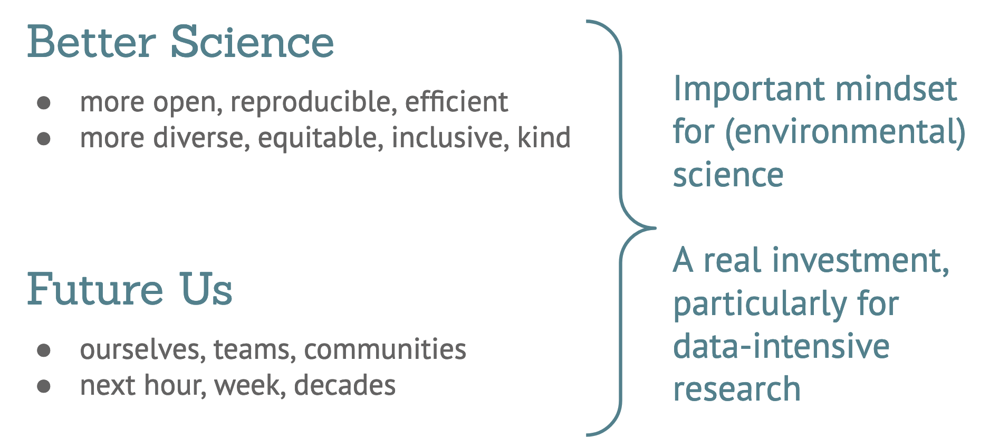

**We believe open practices can accelerate data-driven solutions and increase diversity, equity, inclusion, and belonging in science.** These are critical to uncovering enduring science-based solutions faster, as well as for the well-being and resilience of research communities. We work towards **kinder science.**

We approach open science as a spectrum, as a behavior change, and as a movement. There are many ways to practice open science and to welcome others to participate. We see data analysis and stewardship as powerful entryways for open science, and we meet scientists where they are, helping them develop new skillsets and mindsets of immediate value while empowering them as leaders. We are influenced and inspired by many leaders and community organizers, particularly in climate justice and get out the vote movements.

## Openscapes Mindset

The Openscapes Mindset is about moving away from lonely, individual science and towards science that is more efficient, open, collaborative, inclusive and kind. We describe this for research teams in the [Champions Lesson Series](https://openscapes.github.io/series/). This mindset also drives how we lead Openscapes as a program and an approach, as described below.

## We work openly and for Future Us.

We share imperfect work and work in progress openly. Some examples of this are this Approach Guide, the Lesson Series, as well as our [how-we-work Openscapes Planning GitHub Project](https://github.com/orgs/Openscapes/projects/5). We also have open learning conversations through our Community Calls.

## Growth Mindset

We work with a [Growth Mindset](https://en.wikipedia.org/wiki/Mindset#Fixed_and_growth_mindset), described by Dr. Carol Dweck as having an understanding that our talents and abilities can be developed through effort, good teaching, and persistence. This is opposed to a fixed mindset, where individuals believe their basic abilities, their intelligence, their talents, are just fixed traits and cannot be improved through hard work.

## Continual learning, practice, and iteration

We are continually learning and practicing what we learn. We practice in our Champions Cohorts, Community Calls, our team Seaside Chats, and in conversation. As we practice we iterate with that learning.

## Psychological Safety

We practice and promote [psychological safety](https://rework.withgoogle.com/guides/understanding-team-effectiveness/steps/foster-psychological-safety/), described by [Dr. Amy Edmundson](https://en.wikipedia.org/wiki/Amy_Edmondson) as a shared belief held by members of a team that the team is safe for interpersonal risk taking. 

Part of this practice is to start off team meetings with check-ins to see how everyone is doing that day/week, and explicitly voicing to new partners that psychological safety is foundational to our work and to please speak up if something is ever not feeling right.

## Kinder science

We work not only towards open science, but kinder science, and approach this in our work through empathy and listening, and also onboarding folks to the tooling we use to reduce friction as we collaborate. From Lowndes 2019 [Open Software Means Kinder Science](https://blogs.scientificamerican.com/observations/open-software-means-kinder-science/): "Open science is not just about improving the way we share data and methods; it is also about improving the way we think, work and interact with each other. It’s about technology enabling social infrastructure that can promote inclusivity to create kinder science."

## We use the same open source tools that we teach

We use the same tooling to lead Openscapes that are powerful for research: based in R (RMarkdown, Quarto), GitHub, Google Drive, and Twitter. This is because as researchers these tools have transformed science collaboration and communication and we now can't imagine science without them! Using them daily also keeps us current with modern tooling and provides endless opportunities for learning.

