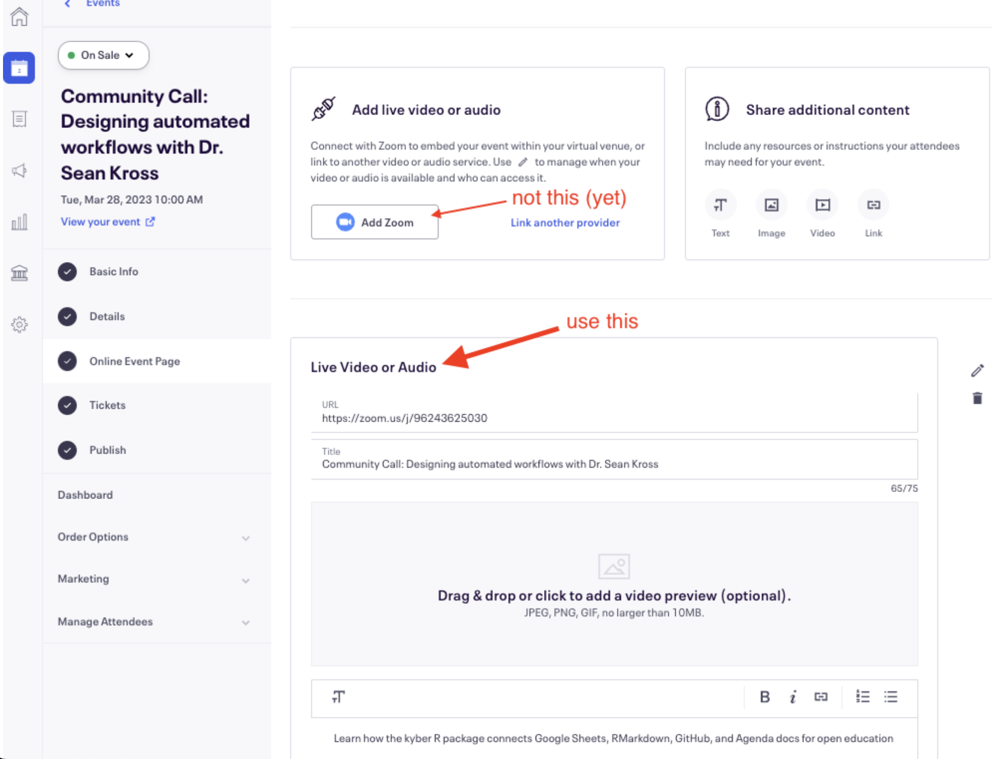
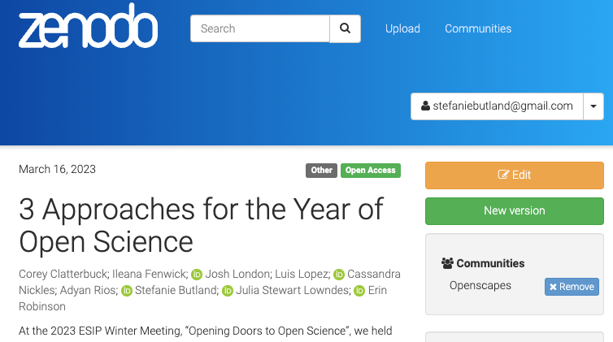
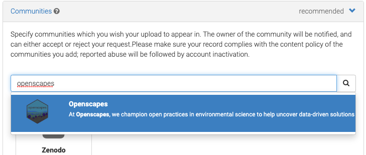

We try to use a few tools that interoperate well and are open source and collaborative.

We also explore and learn new tools but always always with an eye towards interoperability with our current tooling, and with an understanding of how the open science community and environmental/Earth science communities are working.

Below are the tools that we use, why we use them, and set up instructions. (Here are some [Macbook setup notes](https://github.com/Openscapes/teaching-learning-resources/issues/12)).

## Eventbrite

We use Eventbrite to manage registrations for events like the Pathways to Open Science series, and Community Calls. We plan to explore Zoom registration to see if it's a good alternative for our needs.

For [Pathways to Open Science](https://openscapes.github.io/pathways-to-open-science/), we created a **"series" of 6 events** instead of individual events. Challenge was that every event will list the same duration, while reality was they alternated weekly with 1.5hrs for community call and 1hr for coworking.

### Eventbrite - Zoom - Google Cal how-to set up an event

Recommended workflow for now:

1.  Create Google Cal invite \> make it a Zoom meeting from inside that invite (if your Google Cal is integrated with Zoom )\> save. That meeting will appear in your Zoom account. Confirm it has waiting room and no password.

2.  In Eventbrite, create Event \> copy Zoom link into Eventbrite \> Event \> Online Event Page \> Live video or audio, instead of "Add Zoom"

    -   *What didn't work well*: "Add Zoom" button, which used "Stefanie Butland's personal meeting room", created a mtg in Zoom that has a Zoom registration link, not a clear meeting link. Stumped for now as to how to make that Eventbrite-Zoom integration work.

    {width="500"}

3.  Create and schedule reminder emails.Eventbrite \> Manage attendees \> Emails to attendees \> create one custom reminder email. Set reply-to as `hello@openscapes.org`. Delete other default reminders (Eventbrite makes 3 reminders by default and that's annoying). For reminder emails in an event series, we must update for every event in the series.

    -   We create a custom reminder email with *Subject*: Zoom link for Openscapes event-name. *Body*: We're excited to see you later today! At the session start time (5:00 - 6:00 pm ET), please click to join us in Zoom: LINK. Optional, include event logo or Openscapes logo.

    -   *Why a custom email reminer?* Several community call participants said it was hard to find the zoom link with Eventbrite's default reminder email (Stef agrees); that's why we put "Zoom" in subject line of custom reminder.

## GitHub

-   version control for everything that's not Google Drive
-   coordination with Issues and GitHub Projects
-   publishing all our R-based web communications (see next)
-   comms through website

## Google Workspace

We use an Openscapes Google Workspace. This is our default system for Champions Cohorts, however, we have adapted when required to use MS Teams / Sharepoint.

-   Calendar
-   Drive
-   Docs
-   Sheets

We prefer to use Zoom over Google Meet, which we found has some limits to functionality e.g. breakout rooms

We send newsletters via Google Group following this procedure documented by [Stanford IT](https://uit.stanford.edu/service/gsuite/groups/mailinglists/list-faqs):

> Compose your email message. In the "To" field of an email message, instead of adding each team member's email address to your email, just enter the group's address as a recipient.

## ORCID/Rescognito

upcoming

## Quicktime 
### Video editing

Sometimes we want to edit a Cohort Call recording to remove a section from the middle, e.g. Main room chat during breakouts.

This video says it all: [Trimming Clips or Cutting Parts Out of the Middle Using Quicktime](https://youtu.be/82CiWXI4rlQ) (2min 40sec). Briefly:

-   make copy of your video to edit
-   go to start point of section you want to remove
-   use arrow keys for finer navigation
-   Edit \> Split clip \> Done
-   go to end point of section you want to remove
-   Edit \> Split clip \> I think you hit delete on the section to exclude at this point \> Done
-   Save

Once you delete a section \> Done, the clips are automatically spliced together.

Using Edit > Trim, it can be hard to control how fast the yellow Trim brackets move. Let's say we want to trim (delete) everything after time 59 mins. 

- Go to the 59 min point in the video first
- click Edit > Trim ... Yellow brackets appear around the whole video, with a red vertical line - the 'playhead' - at 59 mins. The yellow-bracket segment is the part that will be kept
- Type “i” to move the starting point to the playhead’s position (keep the end of the video), or type “o” to make the ending point at the playhead’s position (keep the beginning of the video).
- Click Trim
- Save

### Screen recording

Thanks to Sam Csik for this tip. 

To make a screen recording without audio, on a Mac, use Quicktime. File > New screen recording > select options for what to share > to end recording, click Stop icon (black box at top of your screen). We can use the video editing instructions above to trim any rough start.

Want to turn your video into a gif to have your screen recording play automatically (instead of having to press play on an embedded video) in a blog post or documentation? Upload your video to https://ezgif.com/video-to-gif/, select the frame rate that most closely matches the length of your video, in seconds.

## R/RStudio

-   all websites and books
-   data analysis (R: tidyverse, RMarkdown)
-   communications and technical writing (RMarkdown, bookdown, blogdown, Quarto)
-   [RStudio and GitHub setup instructions](https://openscapes.github.io/series/how-to/setup-rstudio-github.html)

## Slack

*Are you inviting someone to join Openscapes Slack? Send them the link to this section.*

*Have you received an invitation to join Openscapes Slack? Here's some information to help you get comfortable.*

**How do I use it?** Slack can feel like a daunting new tool, especially when we're introducing lots of new tools during Champions Cohorts. There are both technical and etiquette aspects to getting comfortable. For technical tips see [Getting started for new members](https://slack.com/intl/en-ca/help/articles/218080037-Getting-started-for-new-members) and [How to use Slack](https://slack.com/help/articles/360059928654-How-to-use-Slack--your-quick-start-guide). This Slack [quick start guide](https://doi.org/10.5281/zenodo.3763729) @woodley2020 from the Center for Scientific Collaboration and Community Engagement includes 1) configuring your account; 2) channels and notifications; 3) communicating.

**About Openscapes Slack:** We use Slack as a way to build community by hosting a space for people to connect with each other around Openscapes-relevant topics. We want it to be a supportive, trust-based community of folks doing data intensive science. Members include, but are not limited to, people who have participated in a Champions Program, NASA Openscapes Framework, Pathways to Open Science, Reflections, NASA Cloud Cookbook Hackdays, or other Openscapes programs. Current Slack members can invite others to join - an informal sponsorship approach.

**When you join**, you'll automatically land in several channels: #welcome, #cool-finds, #events, #general, #random, #seaside-chats, #shared-joy 🌈. You can browse other channels and choose to join them. People are invariably friendly and open to asking and answering questions. You can get a feel for how things work by "listening" to the discussions, then jump right in!

If you're part of a cohort for an Openscapes program you'll also be invited to a private cohort channel. Open isn't all or nothing; being open with this cohort you're getting to know is a good way to start getting comfortable with the Slack community more broadly.

The **#welcome channel** is a place for new members to introduce themselves and for the rest of us to help them feel welcome by adding an emoji or saying "I work on sea turtles too!". Here's a short read on [The Value of #Welcome](https://ropensci.org/blog/2017/07/18/value-of-welcome/).

### Channel definitions

These definitions are meant to help people know where to post or ask questions. They are listed in the Slack channel Topic and Description (because the Topic preview is easily visible in the channel, while the Description, not so much).

When people join, they automatically land in #welcome #general #seaside-chats #events #cool-finds #shared-joy #random.

**#welcome**: A place for people new to our community to introduce themselves and for the rest of us to make them feel welcome; the default channel that members cannot leave if they leave all other channels

**#general**: Openscapes team posts Openscapes announcements

**#seaside-chats**: A place to discuss ongoing progress. Friendly Q & A about good enough practices, team culture, tools ...

**#events**: Events that might be of interest to others in our community. Openscapes events go in #general

**#cool-finds**: Posts, datasets, podcasts, repos, papers, videos, packages, ...things you found that are cool

**#jobs**: Job opportunities, seeking work, offers to connect people with those "on the inside"

**#shared-joy**: Sharing joy of any shape or size

**#random**: Non-work banter and water cooler conversation

## Zenodo {#sec-zenodo}

We cover a lot here. See the subheadings in the navigation bar to the right to jump to a section:

-   Zenodo Openscapes Community creation and curation
-   How to add your existing Zenodo record to the Zenodo Openscapes Community
-   How to publish a new record in Zenodo to get a DOI
-   How to get a DOI for materials on GitHub

We want to share our material in a way that other people can find it, use it, improve it, and cite it. For our lesson materials, like Champions Cohorts, this provides a robust way for people to add their participation to their CV as professional development. We use the Zenodo repository and a [Zenodo Openscapes Community](https://zenodo.org/communities/openscapes/) for this purpose.

[Zenodo](https://zenodo.org/) is a general-purpose open repository that allows researchers to deposit research papers, data sets, research software, reports, and any other research related digital artefacts. For each submission, a persistent [digital object identifier](https://en.wikipedia.org/wiki/Digital_object_identifier "Digital object identifier") (DOI) is minted, which makes the stored items easily citable (adapted from [Wikipedia](https://en.wikipedia.org/wiki/Zenodo)). Zenodo allows for versioning and we can preserve GitHub repositories in Zenodo. GitHub itself is *not* a repository. For the full picture, this 1-hr webinar is helpful: [Zenodo: open digital repository \| 2022.12.07](https://youtu.be/yj2r8RayIX8).

We created a [Zenodo Openscapes Community](https://zenodo.org/communities/openscapes/) as a "semantically meaningful group" of research products using these example Zenodo Communities as inspiration: NASA's [Transform to Open Science](https://zenodo.org/communities/tops/); [Center for Scientific Collaboration and Community Engagement (CSCCE)](https://zenodo.org/communities/cscce/).

Zenodo has a Sandbox in which one can create and refine a draft Community before creating the real thing. This webinar section "[How to create a community](https://youtu.be/yj2r8RayIX8?t=734)" screenshares a walk-through that makes things crystal clear. Creating a Sandbox first forces you to recognize decisions to make before creating the real thing, like: needing to create it from an account that looks professional like "curator", rather than a personal email username; or deciding what types of research products to include.

### What do we curate in our Zenodo Openscapes Community?

Anyone can request to have their Zenodo record listed in the Zenodo Openscapes Community. Curator is Stefanie Butland via curator\@openscapes.org. We don't want to include *everything*; too big and its value diminishes. We do curate:

-   Resources on GitHub like the Openscapes Champions Lesson Series, NASA Earthdata Cloud Cookbook, Pathways to Open Science
    -   make a "release" on GitHub and submit that to Zenodo, choose type = other, or lesson. See instructions in [Documentation](https://openscapes.github.idocumentation.qmd#make-our-documentation-citable).
-   key blog posts like ESIP 2022, 2023 panels
    -   create and upload pdf of post from the website, choose type = other
-   slide decks from key presentations
    -   upload pdf of slides, choose type = presentation

We do not curate datasets.

### How to add your existing Zenodo record to the Zenodo Openscapes Community

If you own an **existing** Zenodo record you'd like to have listed, log into Zenodo, go to that record's page, click yellow Edit button (top right) ...

{fig-alt="screenshot of zenodo record page where owner is logged in, showing yellow Edit button" width="460"}

In the Edit page that appears, scroll to Communities section \> type "openscapes" and select it ...

{width="460"}

Click Save \> click Publish (these appear at top and bottom of the edit page)

{width="460"}

curator\@openscapes.org will get email notification of your request and accept, or may ask for further information.

### How to publish a new record in Zenodo to get a DOI

[Video tutorial](https://youtu.be/BPVSErzNtME) from OpenAIRE_eu (4.5 min)

1.  For a blog post or presentation, save as pdf, filename: openscapes_post_name_year.pdf or slides_name_year.pdf, example: openscapes_post_noaa_afsc_2022.pdf

2.  Login to Zenodo (login via GitHub is convenient), go to <https://zenodo.org/deposit/new?c=openscapes> and upload your pdf (files \> start upload). Using that link automatically includes your record in our community collection.

3.  Upload type

    -   blog post: Other
    -   slide deck: Presentation

4.  Basic information

    -   Digital Object Identifier: leave blank
    -   Publication date: date of blog post publication, or presentation
    -   Title: title of post or presentation without adding version number
    -   Authors: use author name consistent with other Zenodo records in their name; add their [ORCID](https://orcid.org/) ID.
        -   If the person has granted ORCID permission to auto-update from Zenodo, this new record will automatically appear in their ORCID profile. This is a pretty great bonus.
        -   We keep a list of Openscapes authors ORCID IDs in `OpenscapesParticipantsMainList` Google sheet, Mentors tab
    -   Description: for an Openscapes blog post, use the italicized preface; for a presentation, use the abstract. End with "**Link to source blog post:** URL"
    -   Version (optional): We've settled on using [CalVer](https://calver.org/): YYYY.0M (zero-padded month) since Luis López said "I like CalVer for books and environments" when we asked for advice. It's a bit redundant with publication date.
    -   **Keywords**: To promote findability and consistency, we suggest using some of these keywords, based on those used by related records. Wow, keywords appear to be case sensitive. Search keywords:"Open Science" gives 1770 records; keywords:"open science" gives 1395 records; keywords:"open science" OR "Open Science" gives 11112 results (not sure why those don't add up) (May 23, 2023)
        -   Openscapes
        -   Open Science
        -   NASA
        -   NOAA
        -   JupyterHub
        -   cloud computing
        -   conference name e.g. ESIP, AGU, SORTEE, FORCE11
        -   Open Educational Resources (for lesson series)

5.  License: Open Access, Creative Commons Attribution 4.0 International

    -   For GitHub releases that include code and documentation, we include a LICENSE.md file on GitHub, then on Zenodo we select Licence: Other (Attribution).

6.  Funding: Would be great to add this, but we've not established guidelines yet

7.  **Publish!** At very top or very bottom, right side of the page, click Save \> Publish \> I understand. Voila! Your Zenodo record is live.

    -   The Zenodo Openscapes Community curator will be notified via email to approve inclusion of your record in the community.
    -   You can edit things like keywords and the Cite as text without affecting the DOI. To make a change to the file(s) itself, you must upload a new version which will give a new DOI.

### How to get a DOI for materials on GitHub

See [**Make our documentation citable**](documentation.qmd#make-our-documentation-citable)

### How to cite Openscapes publications

See "Cite as" in the publication's Zenodo record, in the right-side navigation bar.

## Zoom

<https://zoom.com/downloads>

### Two scenarios for sharing audio in Zoom

This Zoom resource covers two scenarios we use: [Sharing computer sound in a screen share](https://support.zoom.us/hc/en-us/articles/201362643-Sharing-computer-sound-in-a-screen-share). Screenshots below. Practice both beforehand, testing by recording yourself, because they're not obvious and chances of working smoothly on the fly in a meeting are ...low.

Scenario 1. During start of meeting, sharing welcome slides in a loop, with music from spotify playing so audience can hear, and people speaking does not disrupt music. See [**How to share audio with shared visuals**](https://support.zoom.us/hc/en-us/articles/201362643-Sharing-computer-sound-in-a-screen-share#h_01GBXFBZ8GBD3Z3YV70YRETA7Y).

{width="340"}

Scenario 2. During interludes where people are silent journaling, to share audio only, not screen. See [**How to play audio or music without sharing your screen**](https://support.zoom.us/hc/en-us/articles/201362643-Sharing-computer-sound-in-a-screen-share#h_01GBXFC4HB7B83C4T81Y5RRR38).

{width="340"}

IMPT: volume of shared sound is controlled in the source application. If spotify music is too loud, control volume in spotify (not your computer). See [**How to control the volume of a shared sound while in a meeting**](https://support.zoom.us/hc/en-us/articles/201362643-Sharing-computer-sound-in-a-screen-share#h_01GYDPMCB8E21X9YW0DQHKN0DV)

## Zotero

-   <https://www.zotero.org/>
-   Login from browser
-   Download desktop app and Zotero Connector to Firefox

In our Openscapes group library, we have resources not limited to academic articles, but also youtube videos, blogs, teaching resources, and more.
